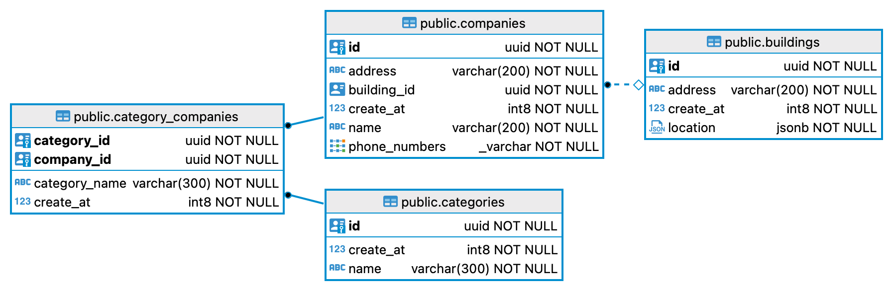

- [Start docker compose](#start-docker-compose)
- [Import Postman config](#import-postman-config)
- [Entities](#entities)
  - [Building](#building)
  - [Location](#location)
  - [Category](#category)
  - [Company](#company)
- [Http api](#http-api)
  - [Constrains](#constraints)
  - [Error](#error)
  - [Warning](#warning)
  - [Endpoints](#endpoints)
    - [POST /v1/categories](#post-v1categories)
    - [GET /v1/categories](#get-v1categories)
    - [POST /v1/buildings](#post-v1buildings)
    - [GET /v1/categories](#get-v1buildings)
    - [POST /v1/companies](#post-v1companies)
    - [GET /v1/categories](#get-v1companies)

## Start docker-compose

For start docker-compose need from root directory of this repository call:
```bash 
  docker-compose up
```

For finish call:

```bash 
  docker-compose down
```

At start docker-compose need some time for initialize db. 

## Import Postman config

For the api test, I suggest using Postman. 
For this need import [Postman config](UGC%20Test%20Task.postman_collection.json) to desktop application.

## Entities

ER Diagram of entities.



### Building

| Field | Type | Description |
| ------------- | --- | ------------- |
| `id` | `string(uuid)` | Unique identification. It generating on server. |
| `create_at` | `int64(timestamp)` | Date creation of the object. Timestamp using in milliseconds. It generating on server. |
| `address` | `string` | Address of the building. |
| `location` | [`location`](#location) | Geographic coordinates for building. |

### Location

| Field | Type | Description |
| ------------- | --- | ------------- |
| `lat` | `float64` | Geographic latitude. Specified by degrees, from -90° to 90°. Example `-82.91218902757737`. |
| `lng` | `float64` | Geographic longitude. Specified by degrees, from -180° to 180°. Example `-175.83667565162875`. |

### Category

| Field | Type | Description |
| ------------- | --- | ------------- |
| `id` | `string(uuid)` | Unique identification. It generating on server. |
| `name` | `string(uuid)` | Name of the category. It consist from words separate of dots. Full name starting from root element and finish on top. Example: `Transport.Petrol.Cars`. |
| `create_at` | `int64(timestamp)` | Date creation of the object. Timestamp using in milliseconds. It generating on server. |

### Company

| Field | Type | Description |
| ------------- | --- | ------------- |
| `id` | `string(uuid)` | Unique identification. It generating on server. |
| `name` | `string` | Name of the company. |
| `create_at` | `int64(timestamp)` | Date creation of the object. Timestamp using in milliseconds. It generating on server. |
| `building_id` | `string(uuid)` | Unique building identification for company. |
| `address` | `string` | Address of the company. |
| `phone_numbers` | `[]string` | List of company phone numbers. |
| `categories` | `[]string` | List of company categories. |

## HTTP API

For creating objects use POST method but for getting GET.
For POST requests parameters sending as json object in request body. For GET requests as url parameters.

In reply on each request comes json object with fields `error`, `warning`, `data`. 
The `data` field can contain one object or an array of objects. It depends on the result. 
For example to fetch a list of companies this will be an array.

Available ports:

* 8000 - main port for api.
* 8001 - debug port for pprof and Statviz.
* 8003 - port for metrics.

### Constraints

* limit - max 100 objects. 
* offset - max 1000 objects.

### Error

| Field | Type | Description |
| ------------- | --- | ------------- |
| `title` | `string` | `title` contain type of the error. |
| `msg` | `string` | `msg` contain description of the error. |

Example in response:

```json
{
  "error": {
    "title": "encoding_json_error",
    "msg": "error on encoding response to json"
  },
  "warning": null,
  "data": null
}
```

### Warning

The warning indicate that request executed with some kind of constraints. 
The most common that `objects_limit_exceeded`. It indicates that in response returned max amount objects.

| Field | Type | Description |
| ------------- | --- | ------------- |
| `title` | `string` | `title` contain type of the warning. |
| `msg` | `string` | `msg` contain description of the warning. |

Example in response:

```json
{
  "warning": {
    "title": "objects_limit_exceeded",
    "msg": "limit: 100 objects"
  },
  "error": null,
  "data": ["..."]
}
```

## Endpoints

### POST /v1/categories

Request for create new category.

#### Body

```json
{
  "name": "string"
}
```

| Field  | Description |
| ------------- | ------------- |
| `name` | Name of category. More [here](#category). |

#### Response

```json
{
  "error": null,
  "warning": null,
  "data":
  {
    "id": "string",
    "create_at": "int64(timestamp)",
    "name": "string"
  }
}
```


### GET /v1/categories

Request for get categories.

#### Parameters

Each parameter have priority. It means that if there is field with high priority, then fields with priority below will be ignored.
Usually very high priority have `id` field.

| Field  | Description |
| ------------- | ------------- |
| `id`  | Unique category identification. High priority. |
| `search_by_name` | Search categories by name. They can be listed via dot or space. Insensitive case. Priority below than `id` field.|
| `from_date` | Search by `create_at` field with condition `create_at >= from_date`. |
| `to_date` | Search by `create_at` field with condition `create_at <= from_date`. |
| `offset` | Offset of result. Better use this field with `ascending` field. Otherwise, repeatability of the result is not guaranteed. |
| `ascending` | Sorting of result by `create_at` field. Value is `true` sorting by ascending, and `false` by descending. If value is not define, then result returning with undefined sorting. |
| `limit` | Limit of amount objects in result. |

#### Response

```json
{
  "error": null,
  "warning": null,
  "data": [
    {
      "id": "string",
      "create_at": "int64(timestamp)",
      "name": "string"
    }
  ]
}
```

### POST /v1/buildings

Request for create new building.

#### Body

```json
{
  "address": "string",
  "location": {
    "lat": "float64", 
    "lng": "float64"
  }
}
```

| Field | Description |
| ------------- | ------------- |
| `address`  | New building address. |
| `location` | Geographic coordinates for building. More [here](#location). |

#### Response

```json
{
  "error": null,
  "warning": null,
  "data": 
    {
      "id": "string",
      "create_at": "int64(timestamp)",
      "address": "string",
      "location": {
        "lat": "float64",
        "lng": "float64"
      }
    }
}
```

### GET /v1/buildings

Request for get buildings.

#### Parameters

Each parameter have priority. It means that if there is field with high priority, then fields with priority below will be ignored.
Usually very high priority have `id` field.


| Field  | Description |
| ------------- | ------------- |
| `id`  | Unique building identification. High priority.|
| `address`  | Search by address. Priority below than `id` field.|
| `from_date` | Search by `create_at` field with condition `create_at >= from_date`. |
| `to_date` | Search by `create_at` field with condition `create_at <= from_date`. |
| `offset` | Offset of result. Better use this field with `ascending` field. Otherwise, repeatability of the result is not guaranteed. |
| `ascending` | Sorting of result by `create_at` field. Value is `true` sorting by ascending, and `false` by descending. If value is not define, then result returning with undefined sorting. |
| `limit` | Limit of amount objects in result. |

#### Response

```json
{
  "error": null,
  "warning": null,
  "data": [
    {
      "id": "string",
      "create_at": "int64(timestamp)",
      "address": "string",
      "location": {
        "lat": "float64",
        "lng": "float64"
      }
    }
  ]
}
```

### POST /v1/companies

Request for create company.

#### Body

```json
{
  "name": "string",
  "building_id": "string",
  "phone_numbers": ["string", "..."],
  "category_ids": ["string", "..."]
}
```

| Field  | Description |
| ----------| ------------- |
| `name` | New company name. |
| `building_id`  | Unique building identification in which the company is located. |
| `phone_numbers` | List of company phone numbers. |
| `category_ids` | List of category ids for the company. |

#### Response

```json
{
  "error": null,
  "warning": null,
  "data": 
    {
      "id": "string",
      "name": "string",
      "create_at": "int64(timestamp)",
      "building_id": "string",
      "phone_numbers": ["string", "..."],
      "categories": ["string", "..."]
    }
}
```

### GET /v1/companies

Request for get companies.

#### Parameters

Each parameter have priority. It means that if there is field with high priority, then fields with priority below will be ignored.
Usually very high priority have `id` field.


| Field  | Description |
| ------------- | ------------- |
| `id`  | Unique company identification. High priority.|
| `building_id`  | Unique building identification in which the company is located. Priority below than `id`, `search_by_category` fields.|
| `search_by_category` | Search by category name. They can be listed via dot or space. Insensitive case. Priority below than `id` field.|
| `from_date` | Search by `create_at` field with condition `create_at >= from_date`. |
| `to_date` | Search by `create_at` field with condition `create_at <= from_date`. |
| `offset` | Offset of result. Better use this field with `ascending` field. Otherwise, repeatability of the result is not guaranteed. |
| `ascending` | Sorting of result by `create_at` field. Value is `true` sorting by ascending, and `false` by descending. If value is not define, then result returning with undefined sorting. |
| `limit` | Limit of amount objects in result. |


#### Response

```json
{
  "error": null,
  "warning": null,
  "data": [
    {
      "id": "string",
      "name": "string",
      "create_at": "int64(timestamp)",
      "building_id": "string",
      "phone_numbers": ["string", "..."],
      "categories": ["string", "..."]
    }
  ]
}
```

